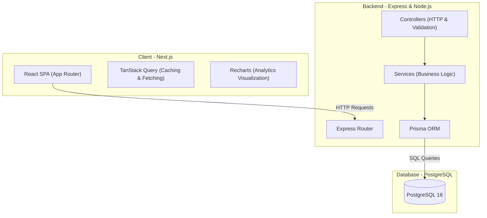
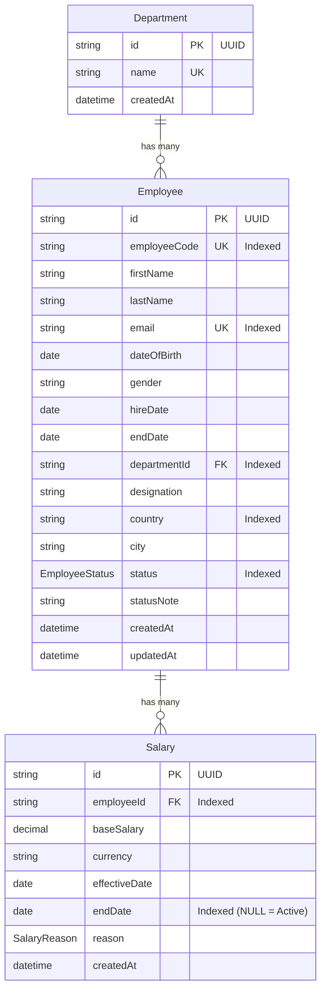

# Architecture Document: Employee Salary Management System

This document outlines the architectural decisions, data models, API design, and system components for the Employee Salary Management System.

---

## 1. System Architecture Overview

The system is built as a decoupled full-stack application deployed via Docker Compose:




### Architectural Layers

1. **Presentation Layer (Frontend)**: Next.js application using React Server Components for initial shell rendering and Client Components for highly interactive pages (Employee Directory, Forms, Analytics Charts).
2. **Routing Layer (Backend)**: Express routes mapping incoming HTTP requests to specific controllers.
3. **Controller Layer (Backend)**: Parses HTTP requests, validates inputs using Zod, handles HTTP status codes, and formats JSON responses.
4. **Service Layer (Backend)**: Contains the core business logic (e.g., salary adjustments, employee status transitions, analytics aggregation). It is database-agnostic and relies on Prisma for data access.
5. **Data Access Layer (Backend)**: Prisma ORM providing type-safe queries and handling migrations.
6. **Persistence Layer (Database)**: PostgreSQL 16 database storing relational data with proper indexes and ACID transactions.

---

## 2. Data Model & Database Schema

The database consists of three primary entities: `Department`, `Employee`, and `Salary`. All primary keys are UUIDs.




### Enums

- `**EmployeeStatus**`: `active | inactive | on_leave`
- `**SalaryReason**`: `initial | promotion | annual_review | adjustment | relocation`

### Database Indexes (Crucial for 10,000+ records)

- `Employee(employeeCode)`: Unique index for fast lookups by code.
- `Employee(email)`: Unique index for fast lookups by email.
- `Employee(departmentId)`: Index for filtering employees by department.
- `Employee(country)`: Index for filtering employees by country.
- `Employee(status)`: Index for filtering employees by status.
- `Salary(employeeId, endDate)`: Composite index to instantly find an employee's active salary (`endDate IS NULL`) or fetch their full salary history.

---

## 3. API Design

All API endpoints are prefixed with `/api` and return JSON responses.

### 3.1. Employee Endpoints

#### `GET /api/employees`

Paginated list of employees with filtering, searching, and sorting.

- **Query Params**:
  - `cursor`: String (employeeCode of the last item from previous page, or a composite cursor depending on the sorting field)
  - `limit`: Integer (default: 25)
  - `search`: String (searches first/last name, email, employeeCode)
  - `departmentId`: String (UUID)
  - `country`: String (2-letter code)
  - `status`: `active | inactive | on_leave`
  - `sortBy`: `name | hireDate | salary`
  - `sortOrder`: `asc | desc`
- **Response**:
  ```json
  {
    "data": [
      {
        "id": "e0b82b3a-59b3-460d-8868-b769dd1541a6",
        "employeeCode": "EMP-202103-01020",
        "firstName": "John",
        "lastName": "Doe",
        "email": "john.doe@acme.com",
        "status": "active",
        "country": "US",
        "designation": "Senior Engineer",
        "department": { "name": "Engineering" },
        "activeSalary": {
          "baseSalary": "125000.00",
          "currency": "USD"
        }
      }
    ],
    "nextCursor": "EMP-202103-01020"
  }
  ```

#### `GET /api/employees/:id`

Fetch a single employee with their complete salary history.

- **Response**:
  ```json
  {
    "id": "e0b82b3a-59b3-460d-8868-b769dd1541a6",
    "employeeCode": "EMP-202103-01020",
    "firstName": "John",
    "lastName": "Doe",
    "email": "john.doe@acme.com",
    "status": "active",
    "hireDate": "2021-03-15T00:00:00.000Z",
    "endDate": null,
    "statusNote": null,
    "department": { "id": "d1a6eb2f-346b-4a47-b0b3-f5e532c04035", "name": "Engineering" },
    "salaries": [
      {
        "id": "s82b3a59-b346-0d88-68b7-69dd1541a6eb",
        "baseSalary": "125000.00",
        "currency": "USD",
        "effectiveDate": "2023-01-01T00:00:00.000Z",
        "endDate": null,
        "reason": "promotion"
      },
      {
        "id": "s541a6eb-2346-b4a4-7b0b-3f5e532c0403",
        "baseSalary": "100000.00",
        "currency": "USD",
        "effectiveDate": "2021-03-15T00:00:00.000Z",
        "endDate": "2022-12-31T00:00:00.000Z",
        "reason": "initial"
      }
    ]
  }
  ```

#### `POST /api/employees`

Create a new employee and their initial salary record (wrapped in a transaction).

- **Request Body**:
  ```json
  {
    "firstName": "Jane",
    "lastName": "Smith",
    "email": "jane.smith@acme.com",
    "dateOfBirth": "1992-08-24",
    "gender": "female",
    "hireDate": "2026-06-22",
    "departmentId": "d1a6eb2f-346b-4a47-b0b3-f5e532c04035",
    "designation": "Software Engineer",
    "country": "US",
    "city": "New York",
    "baseSalary": 95000,
    "currency": "USD"
  }
  ```

#### `PUT /api/employees/:id`

Update employee profile details (excluding salary).

- **Request Body**:
  ```json
  {
    "firstName": "John",
    "lastName": "Doe",
    "designation": "Staff Engineer",
    "city": "San Francisco",
    "status": "on_leave",
    "statusNote": "Sabbatical"
  }
  ```

#### `DELETE /api/employees/:id`

Soft-delete an employee (sets `status` to `inactive`, sets `endDate` to today, and closes active salary).

- **Response**: `204 No Content`

#### `POST /api/employees/:id/salary`

Record a salary adjustment (promotion, adjustment, relocation) by closing the current active salary and inserting a new one. Runs in an ACID transaction.

- **Request Body**:
  ```json
  {
    "baseSalary": 140000,
    "currency": "USD",
    "effectiveDate": "2026-07-01",
    "reason": "promotion",
    "newCountry": "US",
    "newCity": "San Francisco"
  }
  ```

---

### 3.2. Analytics Endpoints

#### `GET /api/analytics/summary`

Global counts.

- **Response**:
  ```json
  {
    "headcount": 10000,
    "activeCount": 9120,
    "onLeaveCount": 320,
    "inactiveCount": 560,
    "departmentCount": 15,
    "countryCount": 10
  }
  ```

#### `GET /api/analytics/by-department`

Department-wise compensation breakdown. Since salaries are in local currencies, results are grouped by department and currency.

- **Response**:
  ```json
  [
    {
      "department": "Engineering",
      "currency": "USD",
      "headcount": 450,
      "avgSalary": "115420.50",
      "medianSalary": "112000.00",
      "minSalary": "65000.00",
      "maxSalary": "210000.00"
    }
  ]
  ```

#### `GET /api/analytics/by-country`

Country-wise compensation stats in local currency.

- **Response**:
  ```json
  [
    {
      "country": "IN",
      "currency": "INR",
      "headcount": 2400,
      "avgSalary": "1850000.00",
      "medianSalary": "1600000.00",
      "totalPayroll": "4440000000.00"
    }
  ]
  ```

#### `GET /api/analytics/salary-distribution`

Histogram buckets for salary ranges per country/currency.

- **Query Params**: `country`: String (default: "US")
- **Response**:
  ```json
  [
    { "range": "50k-75k", "count": 120 },
    { "range": "75k-100k", "count": 340 },
    { "range": "100k-125k", "count": 450 },
    { "range": "125k-150k", "count": 210 },
    { "range": "150k+", "count": 85 }
  ]
  ```

#### `GET /api/analytics/salary-trends`

Historical average salary trends over the last 5 years, grouped by country/currency.

---

## 4. Key Architectural Decisions & Trade-offs

### 4.1. Local Currency Storage vs. Global Base Currency

- **Decision**: Store salaries in local currency only. Group and display analytics by country/currency.
- **Trade-off**: We lose the ability to show a single "Global Average Salary" in USD. However, we gain 100% accurate financial reporting. HR managers do not benchmark Indian salaries in USD; they benchmark them in INR. Converting INR to USD using static rates introduces exchange rate volatility and misleading charts.

### 4.2. Temporal Data Model for Salaries

- **Decision**: Keep a single `Salary` table with `effectiveDate` and `endDate` columns to track history.
- **Trade-off**: Queries for "current salary" require a `WHERE endDate IS NULL` filter, which is slightly more complex than a 1:1 table. However, this avoids duplicating data between a `CurrentSalary` table and a `SalaryHistory` table, eliminates synchronization bugs, and provides a clean timeline of compensation changes.

### 4.3. Constants-Based Countries & Currencies

- **Decision**: Countries and currencies are stored in a TypeScript constants file (`backend/src/constants/countries.ts`) and validated via Zod schemas, rather than database tables.
- **Trade-off**: If the list of countries changed daily, we would need a DB table and CRUD APIs. But countries are static to reduce complexity for the time being.

### 4.4. UUID-Based IDs & Cursor Pagination

- **Decision**: All database primary keys are UUID strings (`@id @default(uuid())`) to prevent ID enumeration and enhance security. However, for cursor-based pagination, we utilize the unique `employeeCode` in combination with secondary sorting fields (like `firstName` or `hireDate`) to ensure deterministic ordering.
- **Trade-off**: While UUIDs are non-sequential and not ideal for sorting/cursor pagination, `employeeCode` is unique, indexed, and sequential or semi-sequential, making it an excellent cursor and tie-breaker. This gives us the security benefits of UUIDs for internal routing and database relations, combined with the readability and performance of `employeeCode` for pagination.

